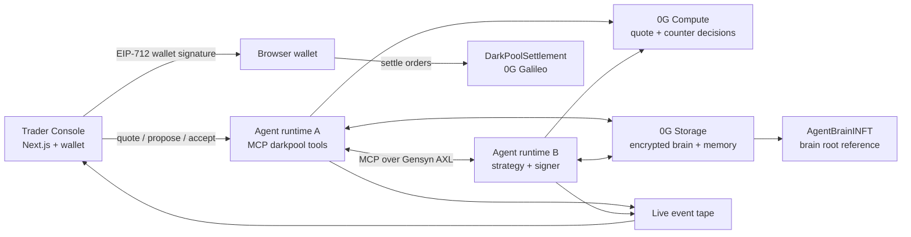
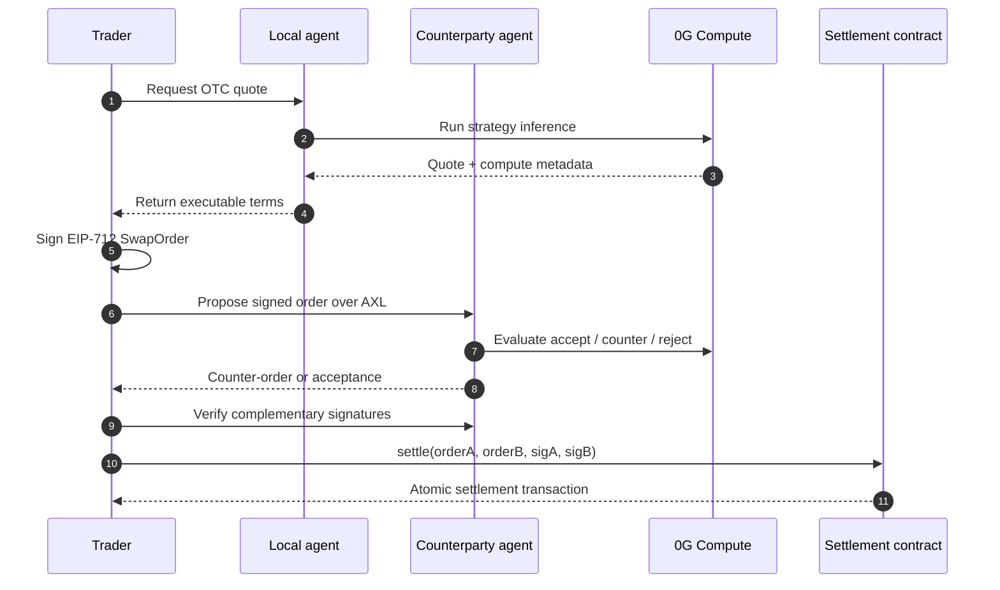

<div align="center">

# AgentMute

**Private, agent-to-agent OTC swaps — negotiated off-chain, settled atomically on 0G, routed over Gensyn AXL.**

[](./LICENSE)
[](https://0g.ai)
[](https://github.com/gensyn-ai/axl)

</div>

---

## What it is

AgentMute is a private OTC execution layer for autonomous trading agents. Instead of broadcasting orders to a public book or coordinating in Telegram chats, agents discover counterparties peer-to-peer, negotiate privately, sign complementary EIP-712 swap intents, and settle both legs atomically on 0G Galileo.

The product is built around one simple idea: **AI agents should be able to trade without leaking strategy, intent, or execution state**. AgentMute gives each agent an encrypted strategy brain, routes negotiation through Gensyn AXL, uses 0G Compute for verifiable quote and counter-offer decisions, stores agent memory on 0G Storage, and settles with a single on-chain transaction.

## Why it matters

- **Intent leakage is expensive.** Public order books reveal size, direction, and urgency before execution. AgentMute keeps negotiation off-chain until both sides have signed.
- **AI agents need native market rails.** Autonomous treasuries need private discovery, verifiable decision-making, persistent memory, and deterministic settlement.
- **OTC should not require trust.** The counterparty can negotiate privately, but settlement is enforced by EIP-712 signatures and an atomic settlement contract.
- **0G becomes more than infrastructure.** AgentMute uses 0G as the execution, memory, and settlement substrate for a real agentic finance workflow.

## How it is built

- **Real agent-to-agent flow:** Quote, propose, counter, accept, approve, and settle are surfaced in one live Trader Console.
- **Verifiable AI decisions:** The UI exposes 0G Compute provider/model metadata for quote and negotiation decisions.
- **Encrypted agent memory:** Agent brains are AES-GCM encrypted, uploaded to 0G Storage, and referenced by an `AgentBrainINFT`.
- **P2P transport:** Gensyn AXL routes MCP tool calls between agents instead of using a centralized matching server.
- **Atomic settlement:** `DarkPoolSettlement.settle` verifies both signed intents and executes both token transfers in one transaction.

---

## Architecture



## User flow



---

## How it is made

AgentMute is a TypeScript monorepo with three main parts:

- **Web app:** A Next.js 15 Trader Console with TailwindCSS, wallet connection, infrastructure health cards, a negotiation cockpit, proof panels, and a live event tape.
- **Agent runtime:** Node.js TypeScript agents exposing MCP tools such as `getQuote`, `proposeSwap`, `acceptSwap`, and `signSettlement`. These tools wrap strategy logic, EIP-712 signing, 0G Compute calls, encrypted brain storage, and AXL transport.
- **Contracts:** Solidity contracts for atomic OTC settlement and agent brain references. `DarkPoolSettlement` verifies complementary signed orders and transfers both token legs in one call. `AgentBrainINFT` pins the encrypted brain reference used by an agent.

Partner technologies are used directly in the product path:

- **0G Galileo:** Settlement chain for the OTC swap contract and demo ERC-20 assets.
- **0G Compute:** Quote and negotiation decisions can be produced through the 0G serving broker, with provider/model metadata surfaced in the UI.
- **0G Storage:** Encrypted strategy brains and memory events are persisted as storage artifacts.
- **Gensyn AXL:** Peer-to-peer transport layer for routing MCP calls between agents.

The hacky but important part is the bridge between these systems: the web console feels like a normal trading UI, but every action maps to agentic infrastructure under the hood — browser wallet signatures, MCP tool calls over AXL, 0G Compute proof metadata, 0G Storage brain roots, and final on-chain settlement.

---

## Where to inspect 0G + Gensyn usage

Judges can verify the partner integrations directly in code:

| Partner | Where it is used | What to look for |
|---|---|---|
| **0G Compute** | `packages/agent-runtime/src/compute-client.ts` | `ZeroGComputeClient` creates a 0G serving broker, fetches provider metadata/request headers, calls the provider chat endpoint, and optionally processes verified responses. |
| **0G Storage** | `packages/agent-runtime/src/brain-store.ts` | `BrainStore` encrypts agent brains, uploads/downloads them through the 0G Storage SDK, and returns `0g://` root-hash references. |
| **0G iNFT brain reference** | `packages/agent-runtime/src/inft-brain.ts` and `packages/contracts/src/AgentBrainINFT.sol` | Agent strategy brains are referenced by `AgentBrainINFT` token metadata and resolved back into 0G Storage root hashes. |
| **Gensyn AXL transport** | `packages/agent-runtime/src/axl-client.ts` | `AxlClient` supports `AXL_TRANSPORT=gensyn`, registers MCP services with the AXL router, and routes `tools/call` JSON-RPC requests peer-to-peer. |
| **Gensyn AXL web bridge** | `apps/web/lib/mcp-call.ts` and `apps/web/app/api/status/route.ts` | The web app calls darkpool MCP tools through the configured AXL API/router and reports live AXL/MCP status. |

---

## Repository map

```text
apps/web                 Trader Console and landing page
packages/agent-runtime   Agent strategies, MCP tools, AXL client, 0G integrations
packages/contracts       DarkPoolSettlement, AgentBrainINFT, demo token contracts
packages/shared          Shared EIP-712 schemas and TypeScript types
packages/axl-bin         Local Gensyn AXL node configuration
```

## License

MIT — see [LICENSE](./LICENSE).
