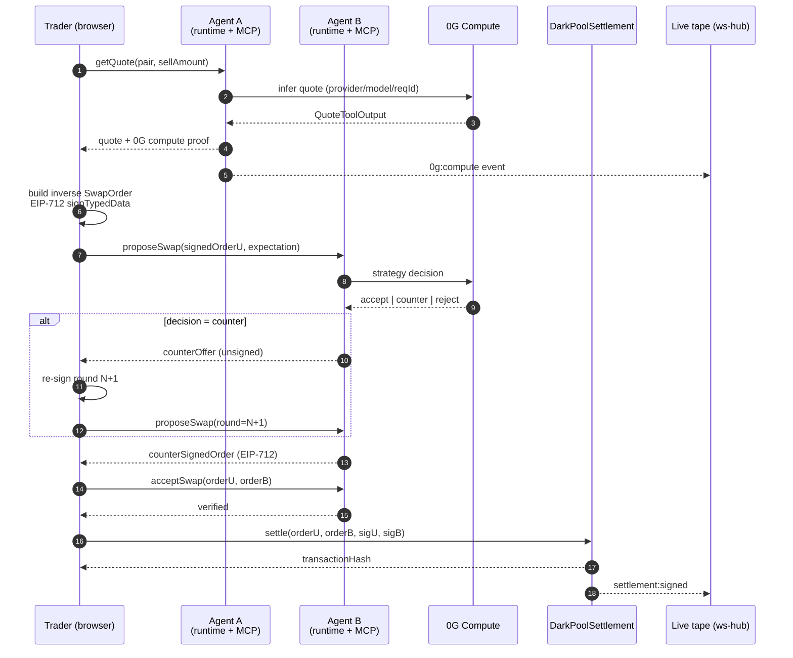

<div align="center">

# AgentMute

**Private, agent-to-agent OTC swaps — negotiated off-chain, settled atomically on 0G, routed over Gensyn AXL.**

[](./LICENSE)
[](https://0g.ai)
[](https://github.com/gensyn-ai/axl)

</div>

---

## What it is

AgentMute is an **OTC dark-pool** for autonomous treasury agents. Two agents discover each other over Gensyn's peer-to-peer MCP network, negotiate a swap privately using signed EIP-712 intents, and settle atomically on-chain through a single audited contract — no mempool, no public order book, no centralized matcher.

Every agent carries an **encrypted "brain"** (strategy + memory) published as an iNFT on 0G Galileo and stored on 0G Storage, and every quote is produced by a verifiable 0G Compute call. The web console surfaces the whole life cycle in real time.

## Why it matters (PMF)

- **OTC is the biggest on-chain flow nobody sees.** Public books leak intent, MEV bots front-run treasuries, and multisig Telegram OTC is the state of the art. AgentMute removes intent leakage without introducing a custodian.
- **AI agents need verifiable, private rails.** As treasuries hand off execution to strategy agents, those agents need (1) secret state, (2) verifiable inference, and (3) settlement guarantees. 0G provides all three; Gensyn provides the transport. AgentMute stitches them into a product.
- **Single atomic swap, zero partial fills.** `DarkPoolSettlement.settle` verifies both EIP-712 signatures, enforces complementary intents, and transfers both legs in one transaction. Either both sides execute or nothing does.

## Highlights

- 🔐 **Private negotiation** — every offer is an EIP-712 `SwapOrder` exchanged through MCP tools over AXL. Nothing hits a public order book.
- 🧠 **iNFT-bound agent brains** — strategies + memory are AES-GCM encrypted, stored on 0G Storage, and pinned by `AgentBrainINFT` (ERC-7857-style wrapper).
- 🤖 **Verifiable inference** — quotes, counters and settlement signatures are produced by the 0G Compute broker, with provider/model/request ID surfaced in the UI.
- 🌐 **Real P2P transport** — Gensyn AXL userspace node + MCP router. A local mock AXL is included for offline demos.
- ⚡ **Atomic on-chain settlement** — one contract call settles both legs on 0G Galileo (chain `16602`).
- 📺 **Live Trader Console** — Next.js 15 + Tailwind UI with a wallet-driven negotiation flow, a live `0g:compute` / `0g:storage` tape, and per-service infra health.

---

## Architecture

### System overview

```mermaid
flowchart LR
    subgraph Browser["Trader Console (Next.js)"]
        UI[Trader UI<br/>EIP-712 signing]
        Wallet[(Browser wallet)]
    end

    subgraph AgentRuntimeA["Agent A runtime"]
        StratA[Strategy]
        BrainA[(Encrypted brain)]
        McpA[MCP server<br/>darkpool tools]
    end

    subgraph AgentRuntimeB["Agent B runtime"]
        StratB[Strategy]
        BrainB[(Encrypted brain)]
        McpB[MCP server<br/>darkpool tools]
    end

    subgraph AXL["Gensyn AXL P2P"]
        NodeA[AXL node A]
        NodeB[AXL node B]
        Router[MCP router]
    end

    subgraph ZeroG["0G stack"]
        Compute[0G Compute<br/>broker]
        Storage[0G Storage<br/>indexer]
        INFT[AgentBrainINFT<br/>ERC-7857-style]
        Settle[DarkPoolSettlement<br/>EIP-712 atomic]
    end

    UI <-->|api/quote&#124;propose&#124;accept| McpA
    UI -->|eth_signTypedData_v4| Wallet
    Wallet -->|settle| Settle

    McpA <-->|MCP over AXL| NodeA
    NodeA <-->|Yggdrasil P2P| NodeB
    NodeB <-->|MCP over AXL| McpB
    Router -. registers services .- McpA
    Router -. registers services .- McpB

    StratA --> Compute
    StratB --> Compute
    BrainA <--> Storage
    BrainB <--> Storage
    Storage -. root hash pinned .-> INFT

    McpA -->|0g:compute&#124;0g:storage events| WSHub((ws-hub))
    McpB -->|events| WSHub
    WSHub -->|live tape| UI
```



### Negotiation + settlement flow



### Repo layout

```
AgentMute/
├── apps/
│   └── web/                  Next.js 15 Trader Console (landing + console + live tape)
├── packages/
│   ├── agent-runtime/        Agent strategy, brain store, darkpool MCP tools, WS hub
│   ├── contracts/            Hardhat workspace: DarkPoolSettlement + AgentBrainINFT + mocks
│   ├── shared/               EIP-712 types, seeded profiles, event shapes (TS types only)
│   └── axl-bin/              Placeholder for the local `gensyn-ai/axl` Go binary + node config
└── .env.example              Every supported env var, grouped by subsystem
```

---

## Quickstart

**Prereqs:** Node 20+, pnpm 9, Go 1.25+ (only for real Gensyn AXL), a 0G Galileo-funded private key if you want live settlement.

### 1. Clone and install

```bash
git clone <this-repo>
cd AgentMute
pnpm install
cp .env.example .env   # fill in ZEROG_* and SETTLEMENT_* as needed
```

### 2. Pick a demo path

#### A. Fully local mock (offline, no gas, no external services)

```bash
pnpm smoke           # two mock AXL nodes, agent A pings agent B
pnpm smoke:phase4    # signed quote → propose → accept loop
pnpm demo            # full live demo: 3 agents + ws-hub + Trader Console
```

Open http://localhost:3000 — the Trader Console will connect automatically.

#### B. Real Gensyn AXL transport

Build the Gensyn AXL node once:

```bash
git clone https://github.com/gensyn-ai/axl.git
cd axl && go build -o node ./cmd/node/ && openssl genpkey -algorithm ed25519 -out private.pem
```

In two terminals (from the AXL repo):

```bash
./node -config node-config.json
cd integrations && pip install -e . && python -m mcp_routing.mcp_router --port 9003
```

Then run AgentMute against the real bridge:

```bash
pnpm preflight:gensyn:axl
AXL_TRANSPORT=gensyn \
AXL_API_URL=http://127.0.0.1:9002 \
AXL_ROUTER_URL=http://127.0.0.1:9003 \
pnpm smoke:gensyn:axl
```

Set `GENSYN_AXL_PING_PEER_ID=<remote-64-char-public-key>` to call a remote peer.

#### C. Live on 0G Galileo (real settlement, real compute, real storage)

```bash
pnpm preflight:galileo              # sanity-check wallet + gas
pnpm deploy:contracts:galileo       # writes packages/contracts/addresses.json
pnpm fund:settlement:galileo        # mints mock ERC-20s + approves settlement
pnpm smoke:settlement:galileo       # broadcasts a real settle() tx
pnpm demo:0g:galileo                # 0G Compute + Storage + iNFT brain proof
```

Only set `SETTLEMENT_AUTO_SUBMIT=true` after the funding step completes.

---

## Web console

```bash
pnpm dev:web
```

The console is a single page with three sections:

1. **Landing** — product story, PMF wedge, architecture highlights.
2. **Trader Console** — wallet connect → trade intent → peer selection → signed negotiation → atomic settlement, with a live 0G Compute / 0G Storage proof panel.
3. **Live tape** — real-time A2A/compute/storage/settlement events streamed from `ws-hub.ts`.

All status is driven by `/api/status`, which probes the configured AXL + router URLs with an automatic fallback to `127.0.0.1` for local development.

---

## Script reference

| Script | What it does |
|---|---|
| `pnpm dev` | Runs the agent demo and Next.js dashboard in parallel |
| `pnpm dev:agents` / `pnpm dev:web` | Run one side only |
| `pnpm demo` | Full live demo: 3 agents + ws-hub + web UI |
| `pnpm smoke` | Two mock AXL nodes, A→B `darkpool/ping` |
| `pnpm smoke:phase3` | Encrypted brain round-trip + deterministic compute |
| `pnpm smoke:phase4` | Signed EIP-712 quote → propose → accept loop |
| `pnpm smoke:settlement` | Local Hardhat settlement end-to-end |
| `pnpm smoke:settlement:galileo` | Real `settle()` on 0G Galileo |
| `pnpm smoke:gensyn:axl` | Registers + pings over a running Gensyn AXL node |
| `pnpm smoke:0g:storage` / `:compute` | Live 0G Storage / Compute sanity checks |
| `pnpm demo:0g:galileo` | One-shot 0G stack proof (compute + storage + iNFT) |
| `pnpm publish:inft:brain` | Upload encrypted brain to 0G Storage, mint/update `AgentBrainINFT` |
| `pnpm fund:settlement:galileo` | Mint demo mUSDC/mWETH/mDAI + approve settlement |
| `pnpm compile:contracts` / `test:contracts` | Hardhat compile + unit tests |
| `pnpm deploy:contracts:local` / `:galileo` | Deploy contracts locally or to Galileo |
| `pnpm typecheck` / `pnpm build` | Workspace-wide TypeScript checks and builds |

---

## Tech stack

- **Frontend:** Next.js 15 (App Router), React 19, TailwindCSS, Lucide, `ethers` v6.
- **Agent runtime:** Node 20 + TypeScript, MCP tools exposed over AXL, `dotenv`, `ws`.
- **P2P transport:** Gensyn AXL (userspace TCP over Yggdrasil) + Python MCP router. Mock AXL ships as a fallback for offline demos.
- **Compute:** `@0glabs/0g-serving-broker` with a deterministic local fallback.
- **Storage:** `@0gfoundation/0g-ts-sdk` / `@0glabs/0g-ts-sdk` for encrypted brain blobs; AES-256-GCM + scrypt envelope.
- **Contracts:** Solidity 0.8.x + Hardhat, OpenZeppelin ERC-20 / ERC-721 / ERC-2981.
- **Live events:** local WS hub (`packages/agent-runtime/src/ws-hub.ts`) with a thin HTTP `/publish` + WS `/ws` surface.

---

## Security notes

AgentMute is hackathon-quality code — audited enough to demo, not enough to hold serious TVL. Known considerations:

- **Keys stay out of git.** `.env`, `*.pem`, `*.key`, and `private.*.json` are gitignored. `.env.example` never contains real values.
- **Rotate the Galileo submitter key before publishing.** If the same key was ever on disk under `ZEROG_PRIVATE_KEY` / `SETTLEMENT_SUBMITTER_PRIVATE_KEY`, rotate it and drain before pushing.
- **Settlement is explicit.** `SETTLEMENT_AUTO_SUBMIT` defaults to `false`; live broadcasts require both an RPC URL and a funded submitter.
- **iNFT is minimal.** `AgentBrainINFT` is an ERC-721 + metadata-hash + encrypted-key-URI wrapper. The full ERC-7857 TEE re-encryption flow is out of scope for this slice.
- **Mock ERC-20s for demos.** `MockUSDC` / `MockWETH` / `MockDAI` are minted freely — don't trade them like real assets.
- **Gensyn AXL transport** is real; the in-process mock AXL is only for offline demos. Enable `AXL_TRANSPORT=gensyn` for anything beyond local testing.

Before pushing to GitHub:

```bash
# sanity check — should print nothing
git grep -nE '0x[0-9a-fA-F]{64}|alchemy\.com/v2/[A-Za-z0-9_-]+' -- . ':!pnpm-lock.yaml' || true
```

---

## License

MIT — see [LICENSE](./LICENSE).
